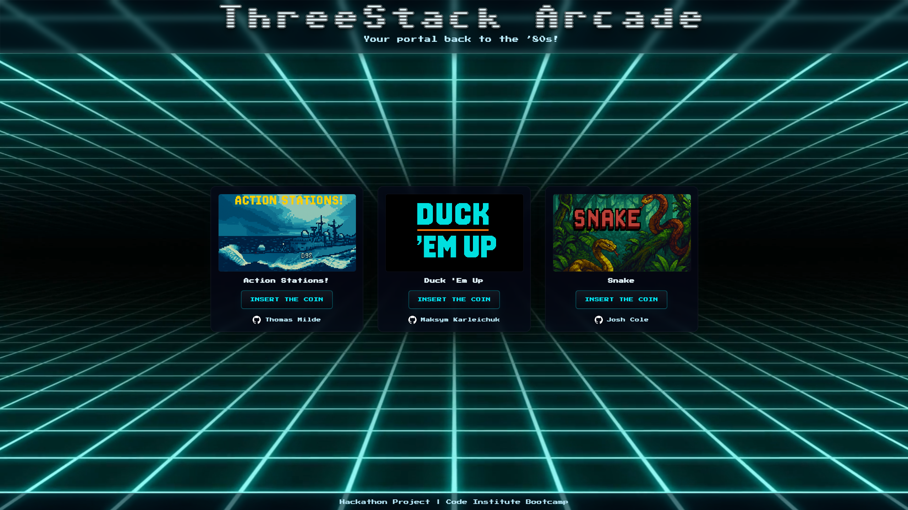

# 🎮 ThreeStack Arcade

**ThreeStack Arcade** is an arcade hub and your portal back to the ’80s built for a Code Institute Full‑Stack Bootcamp hackathon. The hub launches three mini-games (Action Stations, Duck 'Em Up, and Snake). This project demonstrates responsive front‑end design, accessible UX, modular CSS, and vanilla JavaScript focused on DOM manipulation, game loops, state management, and graceful error handling. 🕹️

---

## Table of Contents

1. [Project Overview](#project-overview)
2. [User Experience (UX)](#user-experience-ux)
    - [Target Audience](#target-audience)
    - [User Stories](#user-stories)
    - [Site Owner Goals](#site-owner-goals)
3. [Design & Theme](#design--theme)
    - [Color Palette](#color-palette)
    - [Typography](#typography)
    - [Imagery](#imagery)
4. [Features](#features)
    - [Existing Features (MVP)](#existing-features-mvp)
5. [Mini-Games Overview](#mini-games-overview)
    - [Duck Em Up](#duck-em-up)
    - [Action Stations](#action-stations)
    - [Snake](#snake)
6. [Technologies Used](#technologies-used)
7. [Testing & Validation](#testing--validation)
8. [Deployment](#deployment)
9. [AI‑Assisted Development](#ai-assisted-development)
10. [Credits & License](#credits--license)
11. [Acknowledgements](#acknowledgements)

---

## Project Overview

This project serves as a portfolio piece demonstrating proficiency in front‑end web development technologies. The goal was to build a polished, accessible, and fully responsive single‑page arcade hub that launches three mini‑games each showcasing semantic HTML, modular CSS, and vanilla JavaScript focused on DOM manipulation, game loops, state management, and graceful error handling.

The hub provides clear game previews, touch‑friendly controls and a consistent visual design to guide users from discovery to gameplay.

---

## User Experience (UX)

### Target Audience

-   Casual browser game players looking for short, replayable mini-games.
-   Bootcamp assessors reviewing front‑end, accessibility and JS competency.
-   Developers inspecting modular, maintainable game code.

### User Stories

Must-have:

-   As a visitor, I want a simple hub to preview and launch games.
-   As a player, I want responsive, non-blocking controls with visible feedback.
-   As a player, I want an in-game HUD showing score so I can track progress.

Should-have:

-   Persistent highscores for replay incentive.
-   Touch controls for mobile players.

Could-have:

-   Leaderboards, settings, or additional levels in future releases.

Won't-have (this release):

-   Server-side persistence or multiplayer networking.

### Site Owners Goals

-   Present a clean, accessible single‑page hub linking to each team member’s game.
-   Demonstrate modular CSS/JS and best practices (semantic markup, responsive layout).
-   Provide clear documentation, validation, and an easy deployment workflow.

---

## Design & Theme

Retro-arcade aesthetic with modern, minimal UI so gameplay remains the focus.

### Color Palette

| Color         |       Hex | Usage                     |
| ------------- | --------: | ------------------------- |
| Primary Dark  | `#0b1020` | Backgrounds, headers      |
| Neon Accent   | `#00e5a8` | CTAs, highlights          |
| Mid Gray      | `#2e3440` | Panels, UI elements       |
| Light Neutral | `#f6f8fa` | Content backgrounds, text |

### Typography

-   Clear, large headings and comfortable line heights.

*   [**Sixtyfour**](https://fonts.google.com/specimen/Sixtyfour)
*   [**Press Start 2P**](https://fonts.google.com/specimen/Press+Start+2P)

### Imagery

-   Pixel/retro icons, lightweight sprites in `assets/images/` for crisp scaling and small footprint.

---

## Features

### Existing Features (MVP)

-   Arcade Hub: responsive entry page with game previews and accessible "INSERT THE COIN" play buttons.
-   Action Stations: grid-based battleships game, click or coordinate input, message log.
-   Duck 'Em Up: duck shooting game with multiple levels, rounds, score and overlays.
-   Snake: classic snake with arrow keys and on-screen controls.
-   Accessibility: ARIA labels, focus states for interactive controls.
-   Modular assets: separate CSS/JS per game under `assets/` for maintainability.

---

## Mini-Games Overview

### Duck Em Up

Duck 'Em Up is a fast-paced Duck Hunt–style browser shooter built with semantic HTML for overlays and HUD, modular CSS for visual styling and animations, and vanilla JavaScript for game logic and audio. Players click or tap ducks to shoot them, conserve bullets, and avoid misses - rounds are grouped into levels with progressive difficulty and simple physics for falling ducks.

Key implementation details:

-   HTML

    -   Structured overlays for level and end-state UI: `#level-announcement`, `#game-over-announcement`, `#game-complete-announcement` (accessible via `aria-live` and `role` attributes).
    -   Scoreboard and bullets UI placed in a fixed header-like element for consistent visibility (`#score`, `#bullets`, `#misses`).
    -   Duck elements are appended dynamically to the document body so clicks/touches are handled naturally; restart/play controls are available in overlays.

-   JavaScript

    -   Modular functions: `addDucks()`, `moveDucks()`, `updateUI()`, `renderBullets()`, `endRound()`, `gameOver()`, `gameComplete()`, `startRound()`.
    -   Duck state machine: `flying`, `shot`, `falling`, `flyingAway` with different behaviours (velocity, falling physics, audio).
    -   Level/round progression: controlled by `levelSettings`, `roundsPerLevel` and `currentLevel`/`currentRound`.
    -   Sound design: shot, quack, fall, land, dog reactions and popup SFX play with graceful error handling for autoplay restrictions.
    -   Input handling: click/tap to shoot; document-level miss handling consumes bullets;

-   CSS

    -   Fixed scoreboard and bullet icons using responsive CSS variables.
    -   Overlays use entrance animations and the `.hidden` helper class to toggle visibility (JS adds/removes `.hidden`).
    -   Utility classes: `.dog-popup`, `.duck-shot-image`, `.heart-icon` for popups, shot/fall visuals and lives.

-   Assets

    -   Image and audio assets are stored under `assets/images/` and `assets/sounds/`.

-   UX & Accessibility

    -   `aria-live` is used for announcements so screen readers report level/game state changes.
    -   Touch and mouse support: clicks on non-duck areas count as misses (consumes bullets) to mirror classic gameplay.

-   Behaviour notes
    -   Bullets are initialized each round as `bullets = duckCount + 1`; running out of bullets causes remaining `flying` ducks to flee (`flyingAway`) and counts as misses.
    -   Shot ducks briefly show a `duck-shot` image then transition to `duck-fall` and fall with gravity.
    -   Rounds and levels progress automatically; game over and completion overlays allow the player to restart.

### Action Stations

Action Stations is a simplified clone of the classic game Battleship, depicting only one side of such a game. It was implemented as a single-page app and designed in such a way as to create the feeling of being in a cold-war era surface warship heading into combat, minimising the use of graphics and utilising a special pixel font to approximate the look of low-power computer systems of the era. Special attention was played to placing “environmental storytelling” elements on the game screen to allow the player to take a deeper dive into the game world without having this forced on them.

![assets/images/actionStations_gamePlay.png]

- Key Implementation Details
  - HTML
    - Three-column structure for game board, message log and environmental lore
    - 8x8 game board built using html table
    - Manual target input field and dedicated “Fire” button
    - Dedicated buttons trigger modal pop-ups that provide background lore as well as an explanation of symbols used in gameplay
    - Inactive buttons included for environmental storytelling

  - JavaScript
    - Main functions: constructor(), generateShips(), generateShipLocations(), fire(), guess(), processGuess(), displayHit(), displayMiss(), displayMessage()
    - Math.random() & Math.floor() used to randomise ship position & orientation
    - Gameplay loop: Clicking on game board or entering coordinates and pressing “Fire” button triggers game to check targeted cell ID against known cell ID of target ship. A hit triggers   displayHit() function which displays the appropriate icon on the map, while a miss triggers displayMiss(), which display the icon for a missed shot. Both functions in turn trigger   displayMessage(), which gives text feedback that is shown to player in Message Log.
    - Input: Mouse-based. Provision for keyboard input exists but requires further work

  - CSS
    - Bootstrap used for general layout
    - Custom styling used to recreate 1980s-era computer appearance
    - Bootstrap modals and buttons fitted with additional custom classes to ensure consistent appearance

  - Design Statement
    - Design deliberately minimalist to mimic a work station on a cold-war era warship
    - Specific inspiration was drawn from Royal Navy Type 42 destroyers such as HMS Sheffield or HMS Liverpool, the player ship in Action Stations.
    - Icons used to show hits and misses are drawn from NTDS (Navy Tactical Data System) symbology still used by navies of all NATO members as outlined in NATO STANAG 4420.
    - Use of inactive buttons to indicate inoperable systems, as well as flavour text in Modals are used to create a WW3 ambience and provide in-universe justification for simply shooting at grid squares.
    
-   Behaviour notes
    -   Bullets are initialized each round as `bullets = duckCount + 1`; running out of bullets causes remaining `flying` ducks to flee (`flyingAway`) and counts as misses.
    -   Shot ducks briefly show a `duck-shot` image then transition to `duck-fall` and fall with gravity.
    -   Rounds and levels progress automatically; game over and completion overlays allow the player to restart.

### Snake

Snake is a classic browser game built with **HTML**, **CSS**, and **JavaScript**, rendered on a 32×32 grid. Players control the snake with arrow keys (or on-screen buttons) to eat food, grow longer, and avoid colliding with walls or itself. The game demonstrates dynamic DOM manipulation, grid-based movement logic, modular architecture, and responsive design.

Key implementation details:

-   HTML

    -   Semantic structure with container for grid and UI (scoreboard, game messages).
    -   ARIA labels for accessibility and focusable controls.
    -   Modular sections separated for readability and maintainability.

-   JavaScript

    -   Grid system: 32×32 layout represented as arrays of `{ x, y }` coordinates.
    -   Snake logic: movement updates the array, collision detection, growth when eating food.
    -   Game loop: updates position, renders snake segments, detects collisions.
    -   Event handling: arrow keys and optional on-screen buttons.
    -   LocalStorage used for high score persistence.
    -   Functions modularized: `moveSnake()`, `generateFood()`, `detectCollision()`, `updateScore()`, `resetGame()`, etc.

-   CSS

    -   CSS Grid for the board (`grid-template-columns` & `grid-template-rows`).
    -   Pixel-art ready styling for snake, food, and background.
    -   Directional classes for snake head, body, and tail for proper rotation.
    -   Responsive design and visual feedback for collisions and food consumption.

-   Assets

    -   Optional pixel art sprites for snake segments and food.
    -   Background images or color schemes stored in `assets/images/`.

-   Accessibility & UX

    -   Keyboard-friendly controls with visual focus indicators.
    -   High contrast pixel graphics for visibility.
    -   Scoreboard is clearly displayed with real-time updates.

-   Behaviour notes
    -   Snake moves continuously on a grid; player changes direction with keys.
    -   Eating food grows the snake and increments the score.
    -   Collision with wall or self ends the game and shows reset option.
    -   Game reset restores grid and snake to initial state.

---

## Technologies Used

-   HTML5
-   CSS3
-   JavaScript (ES6+)
-   Git & GitHub
-   Visual Studio Code
-   ESLint, W3C & Jigsaw validators

---

## Testing & Validation

-   Responsiveness across devices
-   Browser compatibility (Chrome, Firefox, Edge)
-   HTML & CSS validation
-   Accessibility checks

---

## Deployment

The website is live at: [ThreeStack Arcade](https://tigerpadla.github.io/threestack-arcade/)

---

## AI‑Assisted Development

AI tools were used to:

-   Draft documentation and README content.
-   Suggest refactors for repetitive DOM updates and event handling.
-   GitHub Copilot was used for code suggestions, troubleshooting, and debugging.

AI accelerated iterations and documentation but final design, validation and deployment decisions were made by the team.

---

## Contributors

-   Maksym Karleichuk - Duck 'Em Up - https://github.com/tigerpadla
-   Thomas Milde - Action Stations - https://github.com/thomil13
-   Josh Cole- Snake - https://github.com/ColeiosCode

---

## Acknowledgements

Thanks to the Code Institute, TIA Skillnet and Rubicon Center teams for support and feedback during the hackathon.
